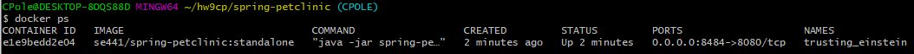
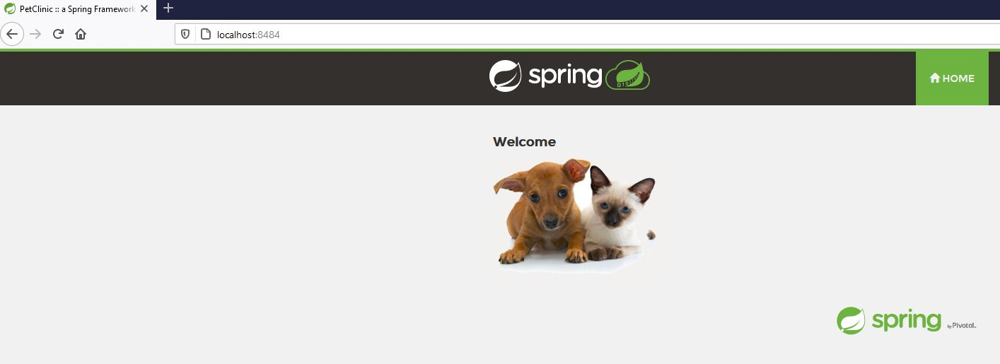
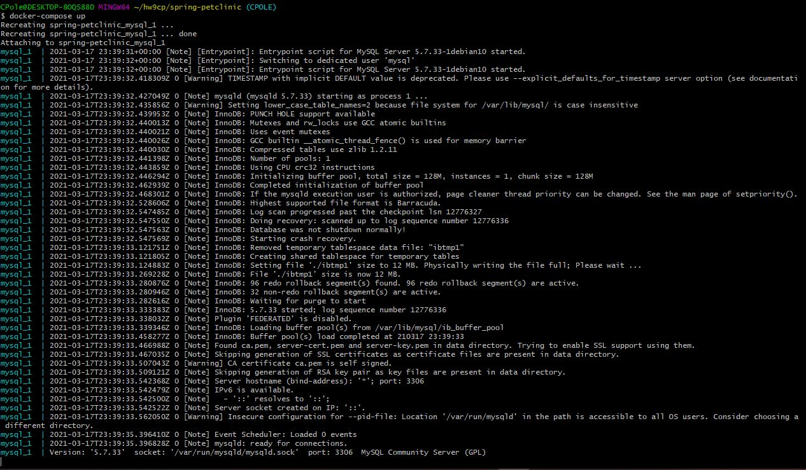
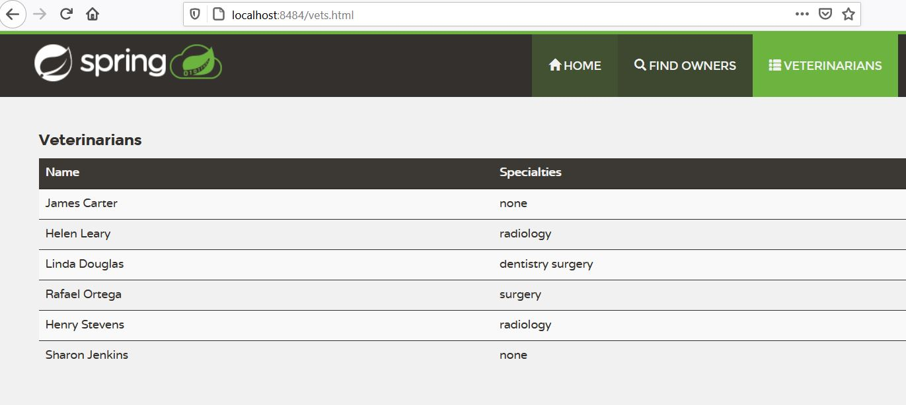
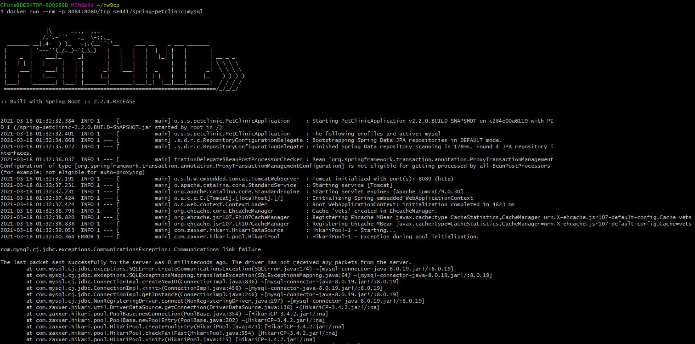
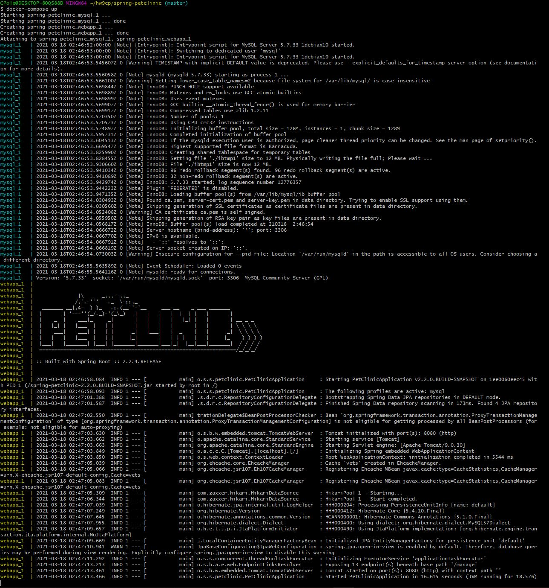
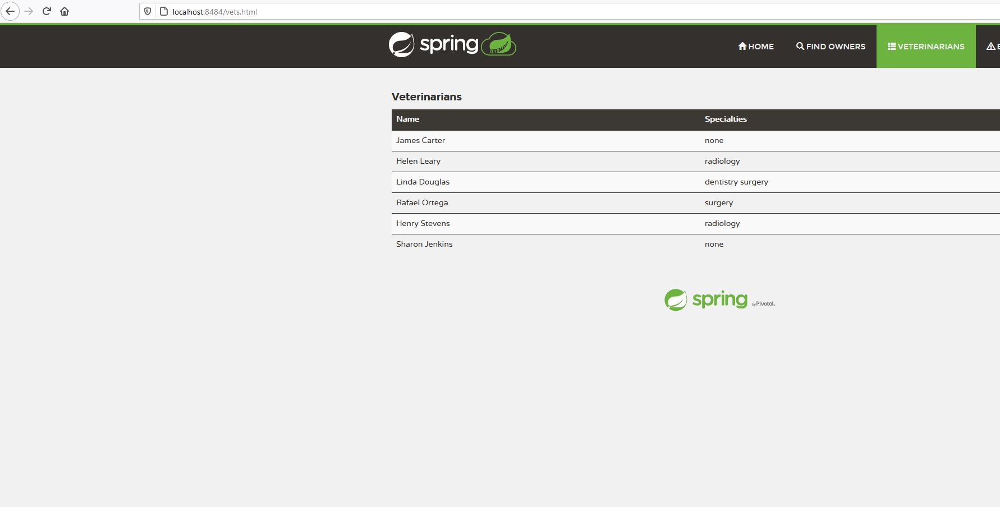

# Instructions

Christopher Pole, ID# 1941713
HW9

**TODO:** Add your screen captures to a new directory called [images](images).

**HINT:** Embed your screen captures as requested in the sections below. You can embed the image using the following syntax:

The first argument is the Alt-text for the image. The second argument is the path to the image. Make sure your images are readable and that you save them in a JPG or PNG format.

# Docker [15 pts]
- [5 pts] Your dockerfile. Please provide a link to this file rather than a screen capture.

Dockerfile:
https://github.com/CPOLE/SE441-HW8/blob/main/deliverables/Dockerfile%20-%20docker

Updated Dockerfile:
https://github.com/CPOLE/SE441-HW8/blob/main/deliverables/Dockerfile%20-%20both

- [5 pts] Your running docker instance as shown by a ps command.

- [5 pts] Your browser accessing the main page of the website from your local container.

# MySQL [15 pts]
- [5 pts] The output from the docker-compose up command.

- [5 pts] Your browser accessing the “Veterinarians” page of the website from your local con-
tainer when you run the application from the host system.

- [5 pts] A section of the stack trace generated when you attempt to run the application
container that has been updated to use MySQL.

# Docker + MySQL [20 pts]
- [5 pts] Your updated docker-compose.yml file containing the application server, built from
your local Dockerfile, and the existing MySQL configuration. Please provide a link
to this file rather than a screen capture.

- [5 pts] Your updated application-mysql.properties file containing the URL change for
the database server. Please provide a link to this file rather than a screen capture.

- [5 pts] The output from the docker-compose up command.

- [5 pts] Your browser accessing the “Veterinarians” page of the website from your local con-
tainer.

